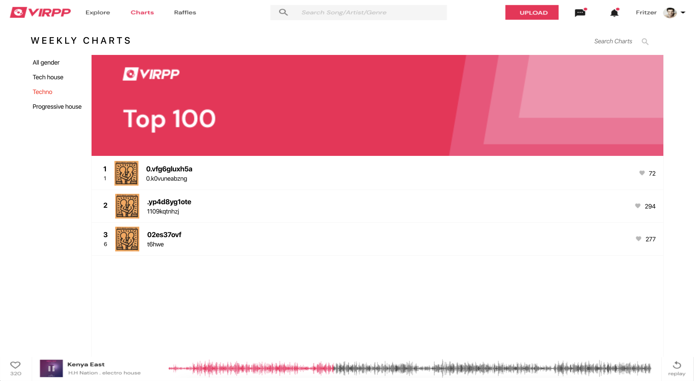

## What is not done due to lack of time:

1. Routing: Every Chart/track should have its own route to load only data for that chart or/and track
2. Saga to handle side effects
3. Styles plugin: cssinjs/less/SC

## How to run

1. `npm install`
2. `npm start`

